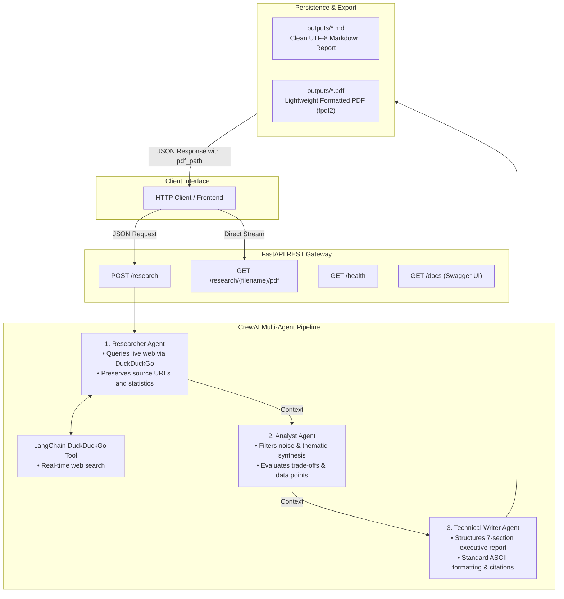

# AI Research Assistant Crew

[](https://www.python.org/)
[](https://fastapi.tiangolo.com/)
[](https://www.crewai.com/)
[](https://www.langchain.com/)
[](https://groq.com/)
[](https://opensource.org/licenses/MIT)

An autonomous multi-agent AI system that conducts real-time web research on any topic and synthesizes publication-grade executive briefs. The system coordinates specialized AI agents (Researcher, Analyst, and Writer), executes live web queries via DuckDuckGo without hallucinations, and delivers clean Markdown and publication-ready PDF reports through a production-grade FastAPI REST service.

---

## Architecture Overview

The system uses **CrewAI** with sequential execution (`Process.sequential`) to coordinate three specialized AI agents, backed by a custom **LangChain** DuckDuckGo web search tool and an automated **fpdf2** PDF publishing pipeline.



### The 5-Stage Workflow

1. **API Ingestion & Validation (`POST /research`)**: Validates the input payload schema using Pydantic, enforcing non-empty topic constraints and returning clean HTTP 4xx client diagnostics before any LLM tokens are consumed.
2. **Autonomous Web Discovery (Researcher)**: Deploys targeted search queries against DuckDuckGo to gather current empirical figures, market data, and verified source URLs.
3. **Analytical Synthesis (Analyst)**: Ingests raw findings, eliminates redundant noise, organizes insights into categorized thematic pillars, and evaluates strategic trade-offs.
4. **Executive Publication (Writer)**: Drafts a structured 7-section executive brief (Executive Summary, Market Trends, Benefits, Challenges, Case Studies, Future Outlook, and References) strictly using standard ASCII formatting.
5. **Dual Persistence & Streaming**: Persists an immutable timestamped `.md` file in [`outputs/`](outputs/), compiles a matching `.pdf` file via `pdf_export.py`, and returns structured JSON with direct download support via `GET /research/{filename}/pdf`.

---

## Key Features

- **Multi-Agent Collaboration**: Sequential chain of specialized agents (Researcher &rarr; Analyst &rarr; Writer) ensuring strict separation of concerns.
- **Zero Hallucination Web Grounding**: Live search queries fetch real-world metrics, dates, and source URLs rather than relying on static model memory.
- **Dual Export (Markdown + PDF)**: Automatically generates clean Markdown and PDF versions of every report without requiring heavy browser engines (like Puppeteer or WeasyPrint).
- **Encoding & Rate-Limit Resilient**: Integrated text normalization sanitizes Unicode punctuation (non-breaking hyphens, special spaces, smart quotes) into clean ASCII, preventing PDF glyph corruption and staying well within Groq TPM limits.
- **Production REST API**: Built on FastAPI with auto-generated OpenAPI/Swagger documentation at `/docs`, automated request validation, and clean error handling.

---

## Project Structure

```text
research-crew/
├── .env.example              # Template for required environment variables
├── requirements.txt          # Pinned dependencies (CrewAI, LangChain, FastAPI, fpdf2)
├── README.md                 # Project architecture, setup guide, and documentation
├── main.py                   # FastAPI REST API wrapper & download endpoints
├── pdf_export.py             # Markdown-to-PDF export engine powered by fpdf2
├── crew.py                   # Sequential crew assembly and task factory definitions
├── agents.py                 # Agent roles, backstories, and Groq LLM configuration
├── tools/
│   ├── __init__.py
│   └── search_tool.py        # LangChain DuckDuckGo search integration
├── outputs/
│   ├── .gitkeep              # Destination directory for generated .md and .pdf reports
│   ├── report_20260912_...md # Sample verified Markdown research report
│   └── report_20260912_...pdf# Sample verified PDF research report
└── tests/
    ├── test_search_tool.py   # Isolated search tool verification test
    └── test_pdf_export.py    # PDF compilation and download endpoint integration test
```

---

## API Endpoints

| Method | Endpoint | Description |
| :--- | :--- | :--- |
| `POST` | `/research` | Trigger the multi-agent research pipeline for a given topic. |
| `GET` | `/research/{filename}/pdf` | Stream/download the generated PDF report directly. |
| `GET` | `/health` | Health check endpoint for monitoring and uptime checks. |
| `GET` | `/docs` | Interactive Swagger UI for live API testing and documentation. |

---

## Setup & Installation

### 1. Prerequisites
- **Python 3.11+**
- Git
- A free [Groq API Key](https://console.groq.com/)

### 2. Clone the Repository
```bash
git clone https://github.com/vedsongire/Research_crew.git
cd Research_crew
```

### 3. Create and Activate Virtual Environment
On Windows (PowerShell):
```powershell
python -m venv .venv
.\.venv\Scripts\Activate.ps1
```

On macOS / Linux:
```bash
python3 -m venv .venv
source .venv/bin/activate
```

### 4. Install Dependencies
```bash
pip install -r requirements.txt
```

### 5. Configure Environment Variables
Copy the example environment configuration:
```bash
cp .env.example .env
```
Edit `.env` (or `env/.env`) and add your credentials:
```ini
# Groq API Key (required for high-speed inference)
MY_API_KEY=gsk_your_groq_api_key_here

# Model configuration
GROQ_MODEL=openai/gpt-oss-120b
MAX_TOKENS=3500
```

---

## Running the Project

### Mode 1: Run via FastAPI REST API (Recommended)
Start the Uvicorn server:
```bash
python main.py
```
*(Or with live-reload: `uvicorn main:app --reload`)*

- Open Swagger UI in your browser: [http://127.0.0.1:8000/docs](http://127.0.0.1:8000/docs)
- Service endpoint: `POST http://127.0.0.1:8000/research`

### Mode 2: Run as Standalone Script
To run the research pipeline directly from the command line without starting a server:
```bash
python crew.py
```

---

## Verified End-to-End Example

Below is a live request and response executed on the pipeline:

### 1. Request
```bash
curl -X POST http://127.0.0.1:8000/research \
  -H "Content-Type: application/json" \
  -d '{"topic": "Boom in the Gaming Industry After the Early 2000s"}'
```

### 2. Response
```json
{
  "status": "success",
  "topic": "Boom in the Gaming Industry After the Early 2000s",
  "filename": "report_20260912_093505_Boom_in_Gaming_Industry_after_early_2000.md",
  "saved_path": "outputs\\report_20260912_093505_Boom_in_Gaming_Industry_after_early_2000.md",
  "pdf_path": "outputs\\report_20260912_093505_Boom_in_Gaming_Industry_after_early_2000.pdf",
  "report": "# Boom in the Gaming Industry After the Early 2000s - Executive Report\n\n## 1. Executive Summary\nThe global video-games market has transformed from a niche $10 bn sector in 2000 to a $187.7 bn powerhouse in 2023 - a cumulative growth of roughly 1,770 %...\n\n## 2. Market Overview & Current Trends\n..."
}
```

### 3. Download the Generated PDF
```bash
curl -O http://127.0.0.1:8000/research/report_20260912_093505_Boom_in_Gaming_Industry_after_early_2000.md/pdf
```

---

## Running Automated Tests

Run the test suite to verify search connectivity and PDF generation:

```bash
# Verify isolated search tool
python tests/test_search_tool.py

# Verify PDF compilation and download endpoint
python tests/test_pdf_export.py
```

---

## License

Distributed under the MIT License. See `LICENSE` for more information.
