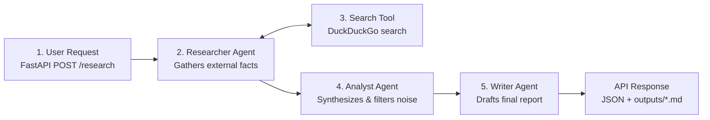

# AI Research Assistant Crew

A multi-agent AI system that takes an input research topic and autonomously produces a comprehensive, publication-ready executive report backed by live web research. The entire pipeline is exposed via a FastAPI REST API endpoint (`POST /research`).

---

## Architecture Overview

The system utilizes **CrewAI** with sequential execution (`Process.sequential`) to coordinate three specialized AI agents, backed by a custom **LangChain** DuckDuckGo web search tool.

### The 5-Stage Workflow



1. **User Request (`POST /research`)**: The client sends a topic via JSON. FastAPI and Pydantic validate the request schema and reject empty or missing topics with clean 4xx client errors before any LLM tokens are consumed.
2. **Researcher Agent**: Takes the topic and actively queries the live web. It gathers empirical statistics, recent developments, real-world case studies, and cited URLs without relying on static memory.
3. **Search Tool**: A custom LangChain `@tool` (`DuckDuckGoSearchRun`) that executes live queries against DuckDuckGo, formatting snippets and source URLs for agent ingestion.
4. **Analyst Agent**: Ingests the raw research notes directly via task context (`context=[research_task]`). It filters out noise, structures insights into thematic pillars, evaluates trade-offs, and preserves verified metrics and sources.
5. **Writer Agent**: Receives the structured briefing via task context (`context=[analysis_task]`). It produces a polished, executive-grade Markdown report with an executive summary, market data tables, strategic recommendations, and verified source references.
6. **API Response & Storage**: The final report is saved as an immutable, timestamped `.md` file in [`outputs/`](outputs/) and returned as a structured JSON response to the user.

---

## Project Structure

```text
research-crew/
├── .env.example              # Template for required environment variables
├── requirements.txt          # Minimal pinned dependencies
├── README.md                 # Setup, architecture guide, and verified examples
├── main.py                   # FastAPI REST API wrapper (POST /research, GET /health)
├── crew.py                   # Crew assembly, task definitions, and sequential pipeline
├── agents.py                 # Agent definitions (Researcher, Analyst, Writer) and LLM config
├── tools/
│   ├── __init__.py
│   └── search_tool.py        # LangChain DuckDuckGo search tool
├── outputs/
│   └── .gitkeep              # Destination for timestamped generated markdown reports
└── tests/
    └── test_search_tool.py   # Isolated test script for the search tool
```

---

## Setup & Installation

### 1. Prerequisites
- **Python 3.11+**
- Git

### 2. Clone the Repository
```bash
git clone https://github.com/vedsongire/Research_crew.git
cd Research_crew
```

### 3. Create and Activate Virtual Environment
On Windows (PowerShell):
```powershell
python -m venv .venv
.\.venv\Scripts\Activate.ps1
```

On macOS / Linux:
```bash
python3 -m venv .venv
source .venv/bin/activate
```

### 4. Install Dependencies
```bash
pip install -r requirements.txt
```

### 5. Configure Environment Variables
Create your local `.env` file from the provided example:
```bash
cp .env.example .env
```
Edit `.env` (or `env/.env`) and add your API credentials:
```ini
# Groq API Key (required for high-speed inference)
MY_API_KEY=gsk_your_groq_api_key_here

# Model configuration
GROQ_MODEL=openai/gpt-oss-120b
MAX_TOKENS=2500
```

---

## How to Run

### Method A: Run via REST API (Production Flow)
Start the FastAPI server using Uvicorn:
```bash
python main.py
```
*(Or run via Uvicorn with auto-reload: `uvicorn main:app --reload`)*

The server starts at `http://127.0.0.1:8000`:
- **Interactive Swagger Documentation:** Open [http://127.0.0.1:8000/docs](http://127.0.0.1:8000/docs) in your browser.
- **Healthcheck:** `GET http://127.0.0.1:8000/health`
- **Research Endpoint:** `POST http://127.0.0.1:8000/research`

### Method B: Run as Standalone Script
To run the full multi-agent crew directly from the terminal without starting the web server:
```bash
python crew.py
```
*(You can edit `test_topic` inside `if __name__ == "__main__":` in `crew.py` to change the topic).*

---

## Real Example Request & Response (Milestone 4 Verification)

Below is an **actual, unedited** HTTP request and response captured during Milestone 4 live testing.

### 1. HTTP Request Sent
```bash
curl -i -X POST http://127.0.0.1:8000/research \
  -H "Content-Type: application/json" \
  -d '{"topic": "Advancements in Solid-State Batteries for Electric Vehicles"}'
```

### 2. Actual HTTP Response Received
```http
HTTP/1.1 200 OK
date: Fri, 11 Sep 2026 03:45:34 GMT
server: uvicorn
content-length: 4260
content-type: application/json

{
  "status": "success",
  "topic": "Advancements in Solid-State Batteries for Electric Vehicles",
  "filename": "report_20260911_091738_Advancements_in_Solid-State_Batteries_fo.md",
  "saved_path": "outputs\\report_20260911_091738_Advancements_in_Solid-State_Batteries_fo.md",
  "report": "# Executive Research Report: The Industrialization of Solid-State Batteries for Electric Vehicles\n\n**Date:** July 2025\n**Prepared For:** Executive Leadership & Strategic Planning Division\n**Subject:** Technical Viability, Market Trajectory, and Strategic Deployment of Solid-State Technology\n\n---\n\n## 1. Executive Summary\n\nThe Electric Vehicle (EV) sector is undergoing a critical transition from a speculative hype cycle to an \"industrialization reality check.\" While Solid-State Batteries (SSBs) represent a pivotal technological leap over conventional Lithium-Ion (Li-ion) cells, the 2025–2026 landscape defines a clear divergence between superior laboratory performance and manufacturing scalability.\n\nThe core strategic insight for this period is that the competitive frontier has shifted from **theoretical potential** to **manufacturable yield** and **supply chain maturity**.\n\nWhile major Original Equipment Manufacturers (OEMs) such as Toyota and the Volkswagen Group (via PowerCo) are approaching the commercialization threshold, timelines have necessarily slipped. These delays are not driven by fundamental scientific failures, but by insurmountable manufacturing hurdles. Specifically, the primary barrier to entry is no longer the electrochemistry itself, but the cost and complexity of scaling solid electrolyte production at automotive-grade quality.\n\n**Strategic Takeaway:** Near-term deployment will remain niche (premium/heavy-duty segments) due to an **8x cost penalty** relative to Li-ion. However, the technology promises transformative operational metrics—including **500 Wh/kg energy density** and **10-minute full charging**—that will redefine EV economics and user experience by late 2027.\n\n---\n\n## 2. Market Overview & Current Trends\n\nThe current market trajectory is characterized by a \"dead heat\" between innovative startups and legacy automotive incumbents, with a clear separation between demonstration vehicles and mass-market readiness.\n\n### Key Market Statistics & Projections\n\n| Metric | Standard Li-ion Baseline | Solid-State Projection (2025-2026) | Strategic Impact |\n| :--- | :--- | :--- | :--- |\n| **Energy Density** | ~250–300 Wh/kg | **500 Wh/kg** (Target) | **2x – 3x Increase** in power-to-weight ratio |\n| **Vehicle Range** | 250–350 miles (Typical) | **750 miles** (Projected) | Significant elimination of range anxiety |\n| **Charging Speed** | 30–45 mins (DC Fast) | **10-minute full charge** | Parity with internal combustion refueling |\n| **Production Cost** | Baseline ($/kWh) | **~8x Higher** | Limits near-term ROI to premium segments |\n| **Safety Profile** | Liquid Electrolyte (Flammability Risk) | Solid Electrolyte (Non-flammable) | Enhanced safety architecture; lower insurance/liability risk |\n| **Primary Chemistry** | NMC / LFP | **Sulfide** | Identified as the leading candidate for high-capacity EVs |\n\n### Current Market Dynamics\n*   **The Sulfide Dominance:** Among the three primary contenders (sulfide, oxide, and polymer), **sulfide-based electrolytes** are currently identified as the leading candidate for high-capacity applications. This is due to their superior ion conductivity metrics, which enable the rapid charging speeds highlighted in the strategic projections.\n*   **OEM Consolidation:** The market is consolidating around major automotive groups that possess the capital reserves to withstand the multi-year gap between prototyping and profitable scale. Startups serving as components suppliers are increasingly being acquired by or entering joint ventures with legacy manufacturers to remain viable.\n*   **Supply Chain Immaturity:** The supply chain for high-purity lithium sulfide and other solid-state precursors is still in its infancy, leading to significant volatility in raw material costs and supply consistency.\n\n---\n\n## 3. Key Benefits & Strategic Advantages\n..."
}
```

### 3. File Saved to Disk
The generated report was automatically saved to:
[`outputs/report_20260911_091738_Advancements_in_Solid-State_Batteries_fo.md`](outputs/report_20260911_091738_Advancements_in_Solid-State_Batteries_fo.md)

---

## Error Handling

The REST API implements defensive input validation:
- **Missing `topic` field**: Returns `HTTP 422 Unprocessable Content` with field validation errors.
- **Empty string or whitespace-only `topic`**: Returns `HTTP 400 Bad Request` with message:  
  `"Invalid input: 'topic' cannot be empty or contain only whitespace. Please provide a meaningful research topic."`
- **Pipeline execution failures**: Intercepted and returned as `HTTP 500 Internal Server Error` with error diagnostics, preventing server crashes.
