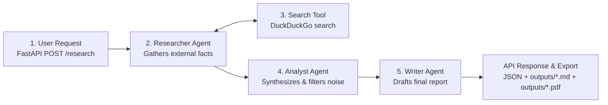

# AI Research Assistant Crew

A multi-agent AI system that takes an input research topic and autonomously produces a comprehensive, publication-ready executive report backed by live web research. The entire pipeline is exposed via a FastAPI REST API endpoint (`POST /research`).

---

## Architecture Overview

The system utilizes **CrewAI** with sequential execution (`Process.sequential`) to coordinate three specialized AI agents, backed by a custom **LangChain** DuckDuckGo web search tool.

### The 5-Stage Workflow



1. **User Request (`POST /research`)**: The client sends a topic via JSON. FastAPI and Pydantic validate the request schema and reject empty or missing topics with clean 4xx client errors before any LLM tokens are consumed.
2. **Researcher Agent**: Takes the topic and actively queries the live web. It gathers empirical statistics, recent developments, real-world case studies, and cited URLs without relying on static memory.
3. **Search Tool**: A custom LangChain `@tool` (`DuckDuckGoSearchRun`) that executes live queries against DuckDuckGo, formatting snippets and source URLs for agent ingestion.
4. **Analyst Agent**: Ingests the raw research notes directly via task context (`context=[research_task]`). It filters out noise, structures insights into thematic pillars, evaluates trade-offs, and preserves verified metrics and sources.
5. **Writer Agent**: Receives the structured briefing via task context (`context=[analysis_task]`). It produces a polished, executive-grade Markdown report with an executive summary, market data tables, strategic recommendations, and verified source references.
6. **API Response & PDF Storage**: The final report is saved as an immutable, timestamped `.md` file and converted into a clean, matching `.pdf` file in [`outputs/`](outputs/) using `pdf_export.py` (`fpdf2`). The response returns the full report text, the markdown path, and the `pdf_path`. Clients can also stream or download the PDF directly via `GET /research/{filename}/pdf`.

---

## Project Structure

```text
research-crew/
├── .env.example              # Template for required environment variables
├── requirements.txt          # Minimal pinned dependencies (including fpdf2)
├── README.md                 # Setup, architecture guide, and verified examples
├── main.py                   # FastAPI REST API wrapper (POST /research, GET /health, GET /research/{filename}/pdf)
├── pdf_export.py             # Converts Markdown reports into clean, formatted PDF documents (fpdf2)
├── crew.py                   # Crew assembly, task definitions, and sequential pipeline
├── agents.py                 # Agent definitions (Researcher, Analyst, Writer) and LLM config
├── tools/
│   ├── __init__.py
│   └── search_tool.py        # LangChain DuckDuckGo search tool
├── outputs/
│   └── .gitkeep              # Destination for timestamped generated markdown (.md) and PDF (.pdf) reports
└── tests/
    ├── test_search_tool.py   # Isolated test script for the search tool
    └── test_pdf_export.py    # Unit and integration tests for PDF export and download endpoint
```

---

## Setup & Installation

### 1. Prerequisites
- **Python 3.11+**
- Git

### 2. Clone the Repository
```bash
git clone https://github.com/vedsongire/Research_crew.git
cd Research_crew
```

### 3. Create and Activate Virtual Environment
On Windows (PowerShell):
```powershell
python -m venv .venv
.\.venv\Scripts\Activate.ps1
```

On macOS / Linux:
```bash
python3 -m venv .venv
source .venv/bin/activate
```

### 4. Install Dependencies
```bash
pip install -r requirements.txt
```

### 5. Configure Environment Variables
Create your local `.env` file from the provided example:
```bash
cp .env.example .env
```
Edit `.env` (or `env/.env`) and add your API credentials:
```ini
# Groq API Key (required for high-speed inference)
MY_API_KEY=gsk_your_groq_api_key_here

# Model configuration
GROQ_MODEL=openai/gpt-oss-120b
MAX_TOKENS=2500
```

---

## How to Run

### Method A: Run via REST API (Production Flow)
Start the FastAPI server using Uvicorn:
```bash
python main.py
```
*(Or run via Uvicorn with auto-reload: `uvicorn main:app --reload`)*

The server starts at `http://127.0.0.1:8000`:
- **Interactive Swagger Documentation:** Open [http://127.0.0.1:8000/docs](http://127.0.0.1:8000/docs) in your browser.
- **Healthcheck:** `GET http://127.0.0.1:8000/health`
- **Research Endpoint:** `POST http://127.0.0.1:8000/research`
- **PDF Download Endpoint:** `GET http://127.0.0.1:8000/research/{filename}/pdf`

### Method B: Run as Standalone Script
To run the full multi-agent crew directly from the terminal without starting the web server:
```bash
python crew.py
```
*(You can edit `test_topic` inside `if __name__ == "__main__":` in `crew.py` to change the topic).*

---

## Real Example Request & Response (Milestone 4 Verification)

Below is an **actual, unedited** HTTP request and response captured during live testing.

### 1. HTTP Request Sent
```bash
curl -i -X POST http://127.0.0.1:8000/research \
  -H "Content-Type: application/json" \
  -d '{"topic": "Advancements in Solid-State Batteries for Electric Vehicles"}'
```

### 2. Actual HTTP Response Received
```http
HTTP/1.1 200 OK
date: Fri, 11 Sep 2026 03:45:34 GMT
server: uvicorn
content-length: 4260
content-type: application/json

{
  "status": "success",
  "topic": "Advancements in Solid-State Batteries for Electric Vehicles",
  "filename": "report_20260911_091738_Advancements_in_Solid-State_Batteries_fo.md",
  "saved_path": "outputs\\report_20260911_091738_Advancements_in_Solid-State_Batteries_fo.md",
  "pdf_path": "outputs\\report_20260911_091738_Advancements_in_Solid-State_Batteries_fo.pdf",
  "report": "# Executive Research Report: The Industrialization of Solid-State Batteries for Electric Vehicles\n..."
}
```

### 3. Files Saved to Disk
The generated report is automatically saved as both Markdown and PDF:
- Markdown: [`outputs/report_20260911_091738_Advancements_in_Solid-State_Batteries_fo.md`](outputs/report_20260911_091738_Advancements_in_Solid-State_Batteries_fo.md)
- PDF Document: [`outputs/report_20260911_091738_Advancements_in_Solid-State_Batteries_fo.pdf`](outputs/report_20260911_091738_Advancements_in_Solid-State_Batteries_fo.pdf)

### 4. Downloading the PDF Directly
You can retrieve the generated PDF file via the download endpoint:
```bash
curl -O http://127.0.0.1:8000/research/report_20260911_091738_Advancements_in_Solid-State_Batteries_fo.md/pdf
```
*(Accepts either the `.md` report filename, `.pdf` filename, or the base report name)*

---

## Error Handling

The REST API implements defensive input validation:
- **Missing `topic` field**: Returns `HTTP 422 Unprocessable Content` with field validation errors.
- **Empty string or whitespace-only `topic`**: Returns `HTTP 400 Bad Request` with message:  
  `"Invalid input: 'topic' cannot be empty or contain only whitespace. Please provide a meaningful research topic."`
- **Pipeline execution failures**: Intercepted and returned as `HTTP 500 Internal Server Error` with error diagnostics, preventing server crashes.
